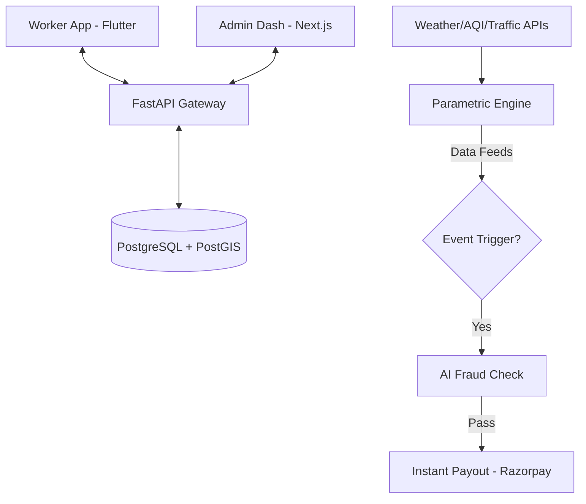

<div align="center">

# 🛡️ GigShield

### *AI-Powered Parametric Income Insurance for Gig Workers*

[](https://opensource.org/licenses/MIT)
[](https://fastapi.tiangolo.com/)
[](https://nextjs.org/)
[](https://flutter.dev/)
[](https://python.org/)
[](https://postgresql.org/)

> **"Your gig stops. Your income shouldn't."**
> GigShield protects delivery workers, cab drivers, and freelancers from income loss caused by rain, traffic, AQI spikes, or zone closures — automatically.

---

[📖 Problem](#-problem-statement) • [⚡ How It Works](#-how-it-works) • [🧱 Tech Stack](#-tech-stack) • [🗺 Architecture](#-system-architecture) • [📦 Repo Structure](#-repository-structure) • [🚀 Getting Started](#-getting-started)

</div>

---

## 🎯 Problem Statement

India has **55 million+ gig workers** — delivery agents, cab drivers, freelancers — with **zero income protection**. When rain hits, an AQI alert shuts a zone, or traffic spikes make delivery impossible, these workers simply lose that day's earnings with no safety net.

Traditional insurance is:
- ❌ Too slow (weeks to process claims)
- ❌ Too complex (paperwork, manual verification)
- ❌ Too expensive (annual premiums gig workers can't afford)
- ❌ Not designed for informal, per-day income patterns

**GigShield solves this** with an AI-powered, fully automated parametric insurance system that detects disruption events in real time and pays workers instantly — no forms, no waiting, no denial.

---

## 💡 What Makes It Different

| Traditional Insurance | GigShield |
|---|---|
| Annual premiums | Weekly micro-premiums (₹20–₹60/week) |
| Manual claim filing | Auto-triggered claims |
| Weeks to settle | Instant payout (< 5 min) |
| Flat pricing | Dynamic AI-based risk pricing |
| Location-agnostic | Zone-aware + GPS verified |
| No data insights | Full analytics dashboard |

---

## ⚡ How It Works

### The 4-Step Loop

```
┌─────────────────────────────────────────────────────────────────┐
│                                                                 │
│   1. ONBOARD          2. MONITOR            3. TRIGGER          │
│   Worker registers ──► Real-time data  ──► Event detected  ──► │
│   KYC + risk score     feeds checked       Rain / AQI / etc.   │
│                                                                 │
│                        4. PAY OUT                               │
│   ◄──────────────────  Claim auto-filed + UPI payout sent       │
│                        (No manual step needed)                  │
│                                                                 │
└─────────────────────────────────────────────────────────────────┘
```

### Seamless Insurance Journey


---

## 🧱 Tech Stack

### 🌐 Frontend
| Layer | Technology | Version | Purpose |
|---|---|---|---|
| Web Dashboard | **Next.js** | v14 | Admin analytics, risk maps, policy management |
| Mobile App | **Flutter** | 3.x | Worker-facing app (cross-platform: Android + iOS) |
| State Management | **Riverpod / Zustand** | Latest | Reactive state across Flutter & Web |
| Maps (Web) | **Mapbox GL JS** | v3 | Live heatmaps, zone overlays, risk visualization |
| Maps (Mobile) | **flutter_map** | Latest | In-app GPS tracking and zone display |
| UI Components | **shadcn/ui** | Latest | Clean, accessible web components |

### ⚙️ Backend
| Layer | Technology | Version | Purpose |
|---|---|---|---|
| Framework | **FastAPI** | 0.110 | High-performance REST API with async support |
| Language | **Python** | 3.11 | Core backend logic |
| Auth | **JWT + Firebase** | — | Stateless token auth + OTP mobile login |
| Task Queue | **Celery + Redis** | Latest | Async trigger checks, claim processing |
| Containerization | **Docker + Compose** | Latest | One-command local development |

### 🧠 AI / Machine Learning
| Model | Algorithm | Library | Input Features | Output |
|---|---|---|---|---|
| **Risk Profiler** | **XGBoost** | scikit-learn | Location, work history, zone risk | Risk Score (0–100) |
| **Premium Engine** | Weighted formula | NumPy | Risk score, loyalty, volatility | Weekly premium ₹ |
| **Fraud Detector** | **Isolation Forest** | scikit-learn | GPS delta, claim freq, activity | Fraud flag (T/F) |
| **Loss Predictor** | **LSTM** | TensorFlow | Hist. earnings, weather, seasons | Predicted loss (₹) |

### 🗺 Maps & Geospatial
| Feature | Technology | How It's Used |
|---|---|---|
| **Live Risk Heatmap** | Mapbox + GeoJSON | Color-coded delivery zones by live risk level |
| **Zone Boundaries** | PostGIS Polygons | Define and detect which zone a worker is in |
| **Anti-Spoofing** | Device + IP + GPS | Cross-validated location to prevent fake claims |
| **Geospatial Queries** | PostGIS | "Is this worker inside a closed zone?" checked server-side |

### 📡 External APIs & Integrations
| API | Provider | Data Fetched | Trigger Condition |
|---|---|---|---|
| **Weather API** | OpenWeatherMap | Rainfall (mm), storm alerts | Rain > 15mm |
| **AQI API** | WAQI / CPCB | PM2.5, PM10, AQI index | AQI > 200 (Hazardous) |
| **Traffic API** | Google Maps | Route speed, congestion | Speed < 10 km/h |
| **Payouts** | Razorpay | Bank/UPI transfer | Auto-dispatched on claim |

### 💾 Database Design
| Database | Technology | Version | Used For |
|---|---|---|---|
| **Primary DB** | PostgreSQL | 16 | Users, policies, claims, payouts, audit logs |
| **Geospatial** | PostGIS | 3.x | Zone maps, GPS validation queries |
| **Cache Layer** | Redis | 7.x | Trigger state, session tokens, real-time data |

### 🔐 Security
| Layer | Mechanism | Details |
|---|---|---|
| **API Auth** | JWT (RS256) | Short-lived tokens + refresh rotation |
| **Mobile Auth** | Firebase OTP | Phone number-based verification |
| **Encryption** | AES-256 | Sensitive IDs (KYC/Payment) encrypted at rest |
| **Rate Limiting** | Redis | IP-based per-endpoint limits |

---

## 🗺 System Architecture



---

## 📦 Repository Structure

```
gigshield/
├── frontend/                        # Next.js Admin Dashboard
│   ├── components/                  # RiskHeatMap, ClaimTimeline, PayoutBreakdown, WorkerRiskCard
│   ├── pages/                       # index, dashboard, claims, zones
│   ├── services/api.js              # Axios API client
│   └── utils/mapbox.js              # Mapbox + GeoJSON helpers
│
├── mobile/lib/                      # Flutter Worker App
│   ├── screens/                     # Onboarding, Dashboard, Policy, Claims, Map
│   ├── widgets/                     # RiskBadge, PayoutCard, AlertBanner
│   ├── services/                    # API, Location (GPS), Notification (FCM)
│   └── models/                      # User, Policy, Claim
│
├── backend/app/
│   ├── main.py                      # FastAPI entry point, CORS, router registration
│   ├── api/                         # REST routes → auth, user, policy, claims, analytics
│   ├── core/                        # config.py (env vars), security.py (JWT + AES)
│   ├── models/                      # SQLAlchemy: User, Policy, Claim, Payout, Zone
│   ├── schemas/                     # Pydantic I/O schemas for all models
│   │
│   ├── services/                    # 🧠 Business Logic
│   │   ├── risk_engine.py           #   Calls XGBoost → risk score (0–100)
│   │   ├── premium_engine.py        #   Dynamic weekly premium (₹20–₹60)
│   │   ├── payout_service.py        #   Income loss calc → Razorpay UPI payout
│   │   ├── policy_service.py        #   Buy / renew / expire weekly policy
│   │   └── notification_service.py  #   FCM push + WhatsApp via Twilio
│   │
│   ├── ml/                          # ⚙️ AI / ML Models
│   │   ├── risk_model.py            #   XGBoost risk profiler
│   │   ├── fraud_model.py           #   Isolation Forest anomaly detection
│   │   └── prediction_model.py      #   LSTM earnings loss predictor
│   │
│   ├── triggers/                    # 📡 Parametric Event Engine (Celery)
│   │   ├── trigger_manager.py       #   Runs all checks every 5 min
│   │   ├── weather_trigger.py       #   Rain > 15mm → OWM API
│   │   ├── aqi_trigger.py           #   AQI > 200 → WAQI API
│   │   ├── traffic_trigger.py       #   Speed < 10 km/h → Google Maps
│   │   └── zone_trigger.py          #   Zone closures / curfew events
│   │
│   ├── fraud/                       # 🔒 Fraud & Validation
│   │   ├── anomaly.py               #   ML + rule-based claim scoring
│   │   └── validation.py            #   GPS spoof check, device fingerprint
│   │
│   └── utils/                       # geo_utils (PostGIS), date_utils (week logic)
│
├── data/                            # Mock CSVs: weather, AQI, activity + zones.geojson
├── docs/                            # Architecture diagram, API spec, ML design
├── scripts/                         # seed_db.py, train_risk_model.py, simulate_trigger.py
├── .env.example                     # All API keys template
├── docker-compose.yml               # FastAPI + Celery + PostgreSQL/PostGIS + Redis
└── README.md
```

---

## 🚀 Getting Started

### 1. Clone & Setup
```bash
git clone https://github.com/your-username/gigshield.git
cd gigshield
cp .env.example .env
```

### 2. Run with Docker
```bash
docker-compose up --build
# Backend: http://localhost:8000/docs
# Admin Dash: http://localhost:3000
```

---

## 🛡️ Security & Anti-Fraud
- **GPS Verification:** Real-time spatial validation via PostGIS.
- **Device ID Pinning:** Prevents multi-device claim abuse.
- **Anomaly Detection:** ML-based detection of outlier claim behaviors.

---

<div align="center">
**GigShield — Because every shift matters.** 🛡️
</div>
