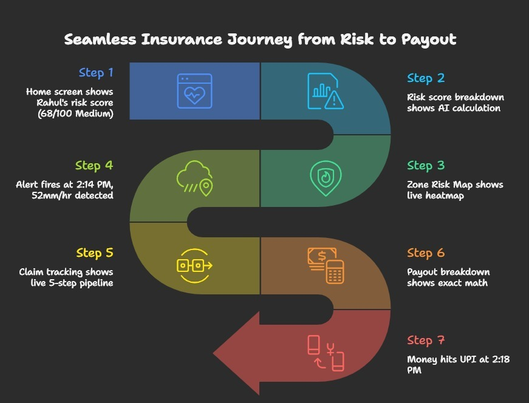

<div align="center">

#  GigShield

### *AI-Powered Parametric Income Insurance for Gig Workers*

[](https://opensource.org/licenses/MIT)
[](https://fastapi.tiangolo.com/)
[](https://nextjs.org/)
[](https://flutter.dev/)
[](https://python.org/)
[](https://postgresql.org/)

> **"Your gig stops. Your income shouldn't."**
> GigShield protects delivery workers, cab drivers, and freelancers from income loss caused by rain, traffic, AQI spikes, or zone closures — automatically.

---
[ Problem](#-problem-statement) • [ Our Solution](#-our-solution) • [Persona & Scenarios](#-persona-scenarios) • [Weekly Premium Model](#-weekly-premium-model) • [Workflow diagram](#-workflow-diagram) • [ Tech Stack](#-tech-stack) • [ Architecture](#-system-architecture) • [ Repo Structure](#-repository-structure) • [Getting Started](#-getting-started) • [Security & Anti-Fraud](#-security-anti-fraud)  • [ Development Plan](#-development-plan) • [Team](#-team) • [Demo](#-demo) 

</div>

---

 ##  The Problem

Gig workers earns about ₹400–₹800/day but have **zero income protection** losing about 20-30% of their income with no protection or compensation due to sudden disruptions like: 
 - Heavy rain / floods → orders cancelled, cannot ride
 - Extreme heat advisories → platform reduces active zones
 - Local curfews / strikes → pickup/drop locations inaccessible

 ---

 ##  Our Solution — GigShield

 GigShield an **AI-enabled parametric income insurance platform** that:
 - Monitors real-time weather, pollution, and social disruption data
 - Automatically detects income-impacting events (parametric triggers)
 - Instantly pays out lost wages to the worker — no claim forms, no waiting

 > **We insure INCOME LOSS only.** No health, accident, vehicle, or life coverage.

 ---

 ## Persona & Scenarios

 **Target User:** 
 - Gig Workers
- Food delivery partners (Zomato, Swiggy)
- Ride-share drivers (Uber, Ola)
- Logistics & parcel delivery workers (Dunzo, Porter)
- On-demand service providers (Urban Company)

 **Typical Profile:**
 - Works 8–10 hours/day, 6 days/week
 - Earns ₹500–₹700/day (approx ₹3,000–₹4,200/week)
 - Owns a two-wheeler, operates in a defined city zone
 - Has a UPI-linked bank account

##  Scenarios

| Scenario | Situation | Trigger | Action | Outcome |
|----------|----------|---------|--------|---------|
| **1️. Food Delivery Partner** | Unable to deliver orders during heavy rain | Rainfall > 50mm/hr | Auto-detect → calculate avg income → trigger payout | Instant income credited |
| **2️. Parcel Delivery (Dunzo)** | Delivery routes blocked due to strike/curfew | Zone disruption (bandh/curfew) | Detect disruption → partial payout for lost hours | Compensation for downtime |
| **3️. Ride-share Driver (Uber/Ola)** | Reduced trips due to extreme heat advisory | Temp > 45°C + advisory | Detect heat risk → calculate missed trips → payout | Income protected |
 ---

 ##  Weekly Premium Model

 GigShield uses a **weekly subscription model** aligned to the gig worker's earnings cycle.

 | Plan | Weekly Premium | Coverage | Best For |
 |------|---------------|----------|----------|
 | Basic | ₹25/week | Up to ₹500/day income protection | Occasional workers |
 | Standard | ₹49/week | Up to ₹700/day income protection | Regular full-time workers |
 | Pro | ₹79/week | Up to ₹1,000/day + priority payout | High-earning partners |

 **Dynamic Pricing:** The weekly premium is adjusted by our ML model based on:
 - Worker's city zone (flood-prone vs safe zones)
 - Historical disruption frequency in that area
 - Worker's average weekly active hours (risk exposure)
 - Seasonal risk factor (monsoon season = higher risk = slightly higher premium)

 **Parametric Triggers (income loss only):**
 1. Rainfall > 40mm/hr in worker's active zone (Weather API)
 2. AQI > 400 (Severe pollution — CPCB API)
 3. Temperature > 45°C with government heat advisory
 4. Verified local curfew / bandh in worker's delivery zone (News/Social API)
 5. Platform-side delivery suspension in zone (Platform API mock)


### Workflow diagram


---

## Tech Stack

###  Frontend
| Layer | Technology | Version | Purpose |
|---|---|---|---|
| Web Dashboard | **Next.js** | v14 | Admin analytics, risk maps, policy management |
| Mobile App | **Flutter** | 3.x | Worker-facing app (cross-platform: Android + iOS) |
| State Management | **Riverpod / Zustand** | Latest | Reactive state across Flutter & Web |
| Maps (Web) | **Mapbox GL JS** | v3 | Live heatmaps, zone overlays, risk visualization |
| Maps (Mobile) | **flutter_map** | Latest | In-app GPS tracking and zone display |
| UI Components | **shadcn/ui** | Latest | Clean, accessible web components |

###  Backend
| Layer | Technology | Version | Purpose |
|---|---|---|---|
| Framework | **FastAPI** | 0.110 | High-performance REST API with async support |
| Language | **Python** | 3.11 | Core backend logic |
| Auth | **JWT + Firebase** | — | Stateless token auth + OTP mobile login |
| Task Queue | **Celery + Redis** | Latest | Async trigger checks, claim processing |
| Containerization | **Docker + Compose** | Latest | One-command local development |

###  AI / Machine Learning
| Model | Algorithm | Library | Input Features | Output |
|---|---|---|---|---|
| **Risk Profiler** | **XGBoost** | scikit-learn | Location, work history, zone risk | Risk Score (0–100) |
| **Premium Engine** | Weighted formula | NumPy | Risk score, loyalty, volatility | Weekly premium ₹ |
| **Fraud Detector** | **Isolation Forest** | scikit-learn | GPS delta, claim freq, activity | Fraud flag (T/F) |
| **Loss Predictor** | **LSTM** | TensorFlow | Hist. earnings, weather, seasons | Predicted loss (₹) |

###  Maps & Geospatial
| Feature | Technology | How It's Used |
|---|---|---|
| **Live Risk Heatmap** | Mapbox + GeoJSON | Color-coded delivery zones by live risk level |
| **Zone Boundaries** | PostGIS Polygons | Define and detect which zone a worker is in |
| **Anti-Spoofing** | Device + IP + GPS | Cross-validated location to prevent fake claims |
| **Geospatial Queries** | PostGIS | "Is this worker inside a closed zone?" checked server-side |

###  External APIs & Integrations
| API | Provider | Data Fetched | Trigger Condition |
|---|---|---|---|
| **Weather API** | OpenWeatherMap | Rainfall (mm), storm alerts | Rain > 15mm |
| **AQI API** | WAQI / CPCB | PM2.5, PM10, AQI index | AQI > 200 (Hazardous) |
| **Traffic API** | Google Maps | Route speed, congestion | Speed < 10 km/h |
| **Payouts** | Razorpay | Bank/UPI transfer | Auto-dispatched on claim |

###  Database Design
| Database | Technology | Version | Used For |
|---|---|---|---|
| **Primary DB** | PostgreSQL | 16 | Users, policies, claims, payouts, audit logs |
| **Geospatial** | PostGIS | 3.x | Zone maps, GPS validation queries |
| **Cache Layer** | Redis | 7.x | Trigger state, session tokens, real-time data |

###  Security
| Layer | Mechanism | Details |
|---|---|---|
| **API Auth** | JWT (RS256) | Short-lived tokens + refresh rotation |
| **Mobile Auth** | Firebase OTP | Phone number-based verification |
| **Encryption** | AES-256 | Sensitive IDs (KYC/Payment) encrypted at rest |
| **Rate Limiting** | Redis | IP-based per-endpoint limits |


##  Repository Structure

```
gigshield/
├── frontend/                        
│   ├── components/                
│   ├── pages/                      
│   ├── services/api.js             
│   └── utils/mapbox.js              
│
├── mobile/lib/                      
│   ├── screens/                     
│   ├── widgets/                     
│   ├── services/                    
│   └── models/                      
│
├── backend/app/
│   ├── main.py                      
│   ├── api/                         
│   ├── core/                           
│   ├── models/                      
│   ├── schemas/                     
│   │
│   ├── services/                    
│   │   ├── risk_engine.py           
│   │   ├── premium_engine.py        
│   │   ├── payout_service.py        
│   │   ├── policy_service.py        
│   │   └── notification_service.py  
│   │
│   ├── ml/                          
│   │   ├── risk_model.py            
│   │   ├── fraud_model.py              
│   │   └── prediction_model.py         
│   │
│   ├── triggers/                       
│   │   ├── trigger_manager.py          
│   │   ├── weather_trigger.py          
│   │   ├── aqi_trigger.py              
│   │   ├── traffic_trigger.py          
│   │   └── zone_trigger.py             
│   │
│   ├── fraud/                          
│   │   ├── anomaly.py                  
│   │   └── validation.py               
│   │
│   └── utils/                          
│
├── data/                               
├── docs/                               
├── scripts/                            
├── .env.example                        
├── docker-compose.yml                  
└── README.md
```

---

##  Getting Started

### 1. Clone & Setup
```bash
git clone https://github.com/your-username/gigshield.git
cd gigshield
cp .env.example .env
```

### 2. Run with Docker
```bash
docker-compose up --build
# Backend: http://localhost:8000/docs
# Admin Dash: http://localhost:3000
```

---

##  Security & Anti-Fraud
- **GPS Verification:** Real-time spatial validation via PostGIS.
- **Device ID Pinning:** Prevents multi-device claim abuse.
- **Anomaly Detection:** ML-based detection of outlier claim behaviors.

---
 ##  Development Plan

 ### Phase 1 (Weeks 1–2) — Ideation & Foundation 
 - [x] Define persona, scenarios, and parametric triggers
 - [x] Design weekly premium model
 - [x] Finalize tech stack
 - [x] Set up GitHub repo and project structure
 - [ ] Build basic UI wireframes

 ### Phase 2 (Weeks 3–4) — Automation & Protection
 - [ ] Worker registration + onboarding flow
 - [ ] Insurance policy creation (weekly)
 - [ ] Dynamic premium calculation (ML model v1)
 - [ ] Parametric trigger engine (3–5 triggers using mock/real APIs)
 - [ ] Claims management module
 - [ ] Basic fraud detection (location + duplicate check)

 ### Phase 3 (Weeks 5–6) — Scale & Optimise
 - [ ] Advanced fraud detection (GPS spoofing, fake weather claims)
 - [ ] Instant payout system (Razorpay sandbox)
 - [ ] Worker dashboard (earnings protected, active coverage)
 - [ ] Admin/insurer dashboard (loss ratios, predictive analytics)
 - [ ] Final demo video + pitch deck

---
 ---

 ## Team
 > *(Add your team member names here)*

 ---

 ##  Demo Video
 > *(Add your 2-minute video link here after uploading to YouTube/Drive)*

 ---

<div align="center">
**GigShield — Because every shift matters.** 🛡️
</div>
